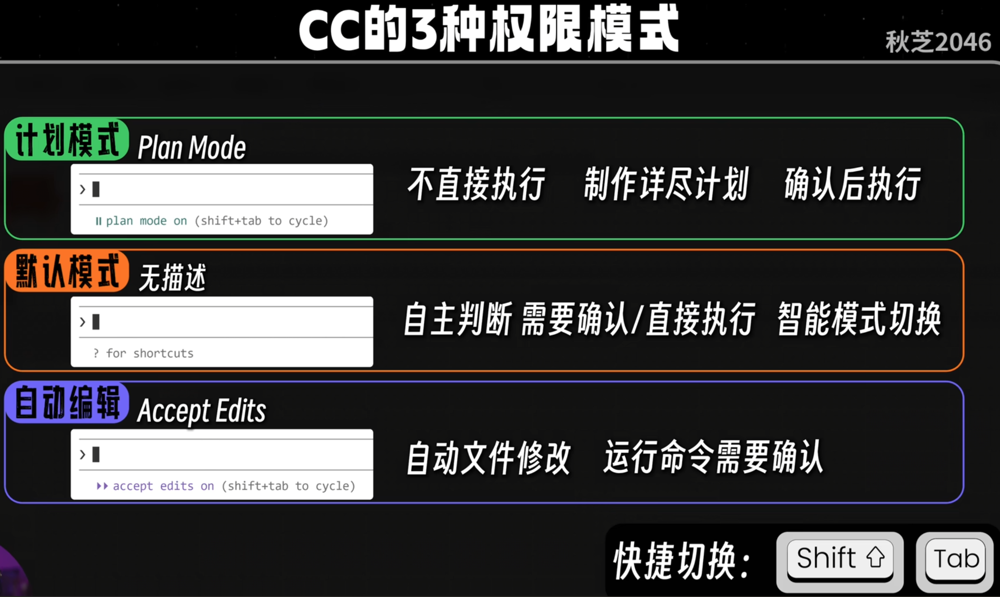
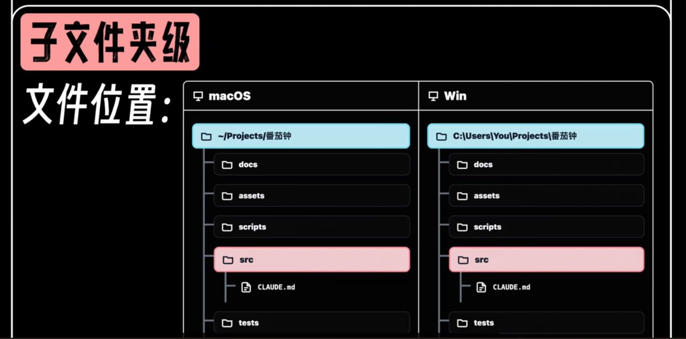

claude --version

shift+tab 切换模式

 claude --dangerously-skip-permissions    允许所有

/help

/model 切换模型

/simplify 代码审查

/rewind 回滚（Esc Esc）

/compact	主动压缩上下文

/resume	恢复对话

/init 项目有一定积累后初始化项目

/memory 打开CLAUDE.md， Auto-memory控制

\+ Enter 换行