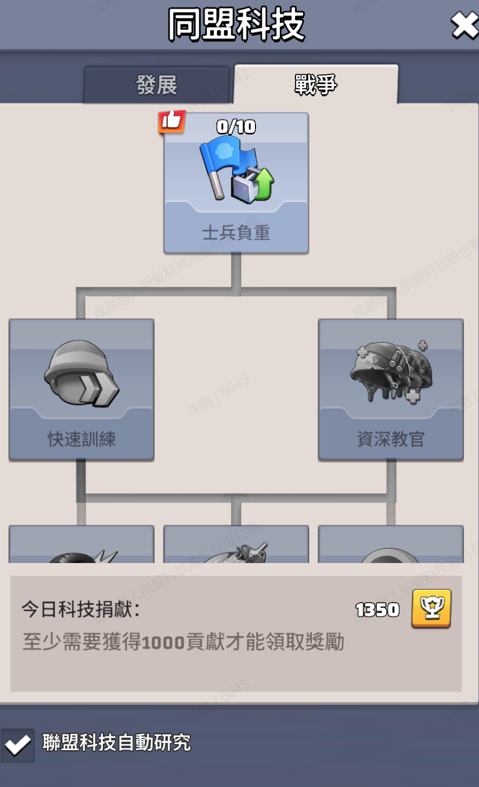

1. 联盟科技 功能，第一阶段开发，制作科技树展示UI（UIAllianceTechnologyTree.cs），里面包含科技树的绘制，绘制思路参考 TechTree.cs 这个科技建筑的科技树绘制，区别之一在于联盟科技树有5列。

   

   1. 点击联盟主页中联盟科技按钮打开联盟科技主页面UIAllianceTechnologyTree.cs，UI功能包含在脚本注释里，页面包含两个页签，对应配置表 Cfg.CUnionResearchCategory 中的“发展”，“战争”的科技类型。
2. 科技树结构由配置 Cfg.CUnionScienceTree 定义，layout指定该科技节点所在第几行第几列，共含有5列，第3列位于正中央，pregroup定义解锁该科技所要解锁的前置科技，union_research_category定义所属科技类型
   3. 无前置科技的科技项默认解锁，其余科技需要前置科技1级以上才解锁，前置科技连线prefab使用AllianceTechLine，需绑定UIAllianceTechLine.cs，其中包含“上竖线”、"折线"、“下竖线” ，prefab中默认都是用的"dark"未解锁版本的图片， 已解锁该条线时图片替换为 "light版图片"，如 “ui_Allied_Technology_line_dark_1”替换为"ui_Allied_Technology_line_light_1"。
